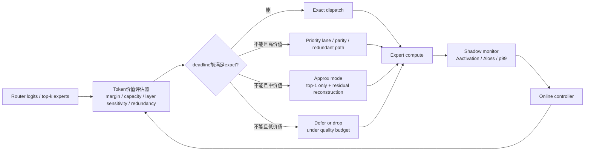

# MoE AllToAll 通信研究综览与 bounded-loss 设计评估

## 执行摘要

如果把近几年的 MoE 通信工作放在一张图里看，主线其实很清楚：**大多数高影响力工作并不是在“近似丢一点通信也没事”这个方向上取胜，而是在“少传、晚传、重排、并行、分层、局部化、可移植化”这些 exact 或 near-exact 的系统手段上取胜**。直接面向 MoE AllToAll 的论文，主要集中在 MLSys、USENIX ATC、ICML、ICLR 等 venue；NSDI、OSDI、SIGCOMM、SoCC 上更常见的是**可迁移到底层 collective、transport、fabric、tail-latency、NIC/CPU proxy** 的工作，然后再被 MoE 这样的 EP workload 继承使用。换句话说，**顶级网络/系统 venue 对 MoE 的兴趣，更多体现在“如何把动态、非均匀、细粒度、跨节点的通信做稳做好”**，而不是仅仅把 router 或 expert 结构调一调。citeturn30view0turn31view0turn14search1turn16search0turn53search2turn18view0turn21view0turn23view0

当前最成熟的解法大致分成五类：**路由/容量控制**，例如 GShard、Switch、BASE、DeepSeek-V3 这条线；**调度与 locality 优化**，例如 SmartMoE、NetMoE、MoNTA、Occult、C2R；**compute-communication overlap**，例如 Tutel、Lina、Lancet、ScMoE、MegaScale-MoE；**kernel/dispatcher/通信库工程化**，例如 FastMoE/FasterMoE、DeepEP、UCCL-EP、Megatron Core Parallel Folding；**底层 transport/fabric/tail 优化**，例如 MLT、OptiReduce、multi-NIC control plane、mFabric。它们共同面对的瓶颈包括：跨节点带宽不足、AllToAll 的非均匀与动态性、tail latency、straggler、跨层 expert load skew、以及专家路由与物理拓扑不对齐。citeturn50view0turn51view0turn49view0turn38view0turn20view3turn26view1turn43view0turn28search5turn44view0turn21view0turn18view2turn23view0turn46view0turn37view0turn36view0turn32view0turn35view0turn30view1turn31view1turn34view0

对你关心的 **bounded-loss AllToAll using token-level semantics**，结论不是“不行”，而是：**只有把它从“网络层 drop some packets”升级成“带质量预算的语义化 approximate collective”才有发表潜力**。MoE 和普通 AllReduce 最大的不同，在于 token 的价值天然不均匀：router logit、top-k margin、expert capacity、token redundancy、layer criticality 都在告诉你“哪些 token 更值钱”。这给了你一个比 MLT/OptiReduce 更强的切入点：**不是对所有 bytes 一视同仁，而是对 MoE token 做 value-aware deadline scheduling**。但反过来，MoE 社区也已经通过 MegaBlocks、BASE、DeepSeek-V3、C2R 等工作提醒我们：**错杀 token、错配 routing、破坏 specialization 的代价是真实存在的**。因此如果论文主张 bounded-loss，就必须把“loss”定义在 **最终质量退化** 上，而不是“网络丢包率”上。citeturn30view1turn31view1turn50view0turn50view2turn38view1turn22view1turn49view0turn44view0

在我看来，真正有机会做成顶会系统工作的不是“直接 drop 第二个 expert 的 token”，而是下面三条更强的主线：**质量预算驱动的 semantic EP transport**、**router/locality/placement 联合优化**、以及 **exact/approx 混合的层级 EP collective**。这三条都能把 MoE 的语义信息与网络层决策真正耦合起来，并形成清晰的 latency–quality Pareto frontier。citeturn39view0turn43view0turn28search5turn46view0turn34view0turn32view0

## 文献版图

为便于阅读，下面的“作者”列通常列首位作者或前三位作者加“等”；“链接”列用可点击来源替代裸 URL。

| 论文 | Venue | 年份 | 作者 | 与 MoE AllToAll 的关系 | 链接 |
|---|---|---:|---|---|---|
| Towards Domain-Specific Network Transport for Distributed DNN Training | NSDI | 2024 | Hao Wang, Han Tian, Jingrong Chen, 等 | 面向分布式 DNN 的专用 transport，核心机制包括 bounded loss tolerance、细粒度 packet spray、in-network packet counting；虽然不是 MoE 专稿，但它是“bounded-loss collective”最直接的前置系统工作之一 | 论文页 citeturn30view0turn3search4 |
| OptiReduce: Resilient and Tail-Optimal AllReduce for Distributed Deep Learning in the Cloud | NSDI | 2025 | Ertza Warraich, Omer Shabtai, Khalid Manaa, 等 | 在云上做 resilient/tail-optimal AllReduce，结合 Hadamard transform，对“有损但可收敛”的 distributed ML transport 很关键；对 MoE 的启发是“近似可靠性”可以被系统层接纳，但目前目标仍是梯度/collective，而非 token 语义 | 论文页 citeturn31view0turn31view1 |
| Enabling Efficient GPU Communication over Multiple NICs Using Dynamic Control Plane | OSDI | 2025 | Zhenghang Ren 等 | 多 NIC 动态控制面，不是 MoE 专用，但官方页面明确报告其可将 MoE 训练吞吐提升至多 1.3×；属于“底层 GPU 网络 substrate 优化” | 论文页 citeturn14search1 |
| UCCL-EP: Portable Expert-Parallel Communication | OSDI 接收 / arXiv | 2026 | Ziming Mao, Yihan Zhang, Chihan Cui, 等 | 直接面向 expert-parallel communication，解决 DeepEP 风格方案在异构 GPU/NIC 上可移植性差的问题；是截至目前最接近“OSDI 级 MoE EP primitive”的工作之一 | 论文页 citeturn16search0turn32view0turn16search12 |
| MegaScale-Infer: Serving Mixture-of-Experts at Scale with Disaggregated Expert Parallelism | SIGCOMM | 2025 | Ruidong Zhu, Ziheng Jiang, Chao Jin, 等 | 用 disaggregated expert parallelism 做 MoE serving，把 attention 与 FFN 解耦，并引入 M2N 通信库减少 GPU-CPU 拷贝、group init 与同步；属于 SIGCOMM 上非常典型的“MoE 通信系统化”工作 | 论文页 citeturn53search0turn53search2 |
| mFabric: An Efficient and Scalable Fabric for Mixture-of-Experts Training | arXiv 预印本 | 2025 | Xudong Liao, Yijun Sun, Han Tian, 等 | 直接面向 MoE 训练 fabric，利用测量发现的 strong locality，提出 training-time topology reconfiguration；虽然我没有在已归档 conference proceedings 中确认最终 venue，但它非常值得关注 | 论文页 citeturn15search12turn34view0turn34view3 |
| UCCL: An Extensible Software Transport Layer for GPU Networking | arXiv 预印本 | 2025 | Yang Zhou, Zhongjie Chen, Ziming Mao, 等 | 通用 GPU networking 软件 transport，可在 host CPU 上快速实现 multipath 等创新，对未来 EP/AllToAll 定制 transport 很有价值 | 论文页 citeturn7academia13 |
| MegaScale-MoE: Large-Scale Communication-Efficient Training of Mixture-of-Experts Models in Production | EuroSys | 2026 | Chao Jin, Ziheng Jiang, Zhihao Bai, 等 | 虽然不是 CCF-A，但它是 2025–2026 这波最重要的生产级 MoE 训练系统之一，尤其适合作为你做 baseline 和 system-design 参考 | 论文页 citeturn37view0turn13search13 |

上表背后的一个重要观察是：**顶级网络/系统 venue 已经开始接受“MoE 通信是一个独立系统问题”这个命题，但真正以 MoE AllToAll 为中心的工作仍然不算多，更多成果仍分散在 ATC、MLSys、ICML、ICLR 与 arXiv 工程报告中**。这对选题是好消息，因为说明问题真实且仍有空间；也是坏消息，因为想把工作送去 NSDI/OSDI/SIGCOMM，就不能只做 kernel trick，而要给出**网络层或 runtime 层的通用系统洞见**。citeturn16search0turn53search2turn18view0turn21view0turn23view0turn37view0

下面是**直接面向 MoE 通信、AllToAll、routing、capacity、expert scheduling** 的代表论文清单。

| 论文 | Venue | 年份 | 作者 | 关键词 | 链接 |
|---|---|---:|---|---|---|
| GShard: Scaling Giant Models with Conditional Computation and Automatic Sharding | ICLR | 2021 | Dmitry Lepikhin 等 | 稀疏 MoE、自动 sharding、2048 TPU、600B | 论文页 citeturn50view0 |
| BASE Layers: Simplifying Training of Large, Sparse Models | ICML | 2021 | Mike Lewis, Shruti Bhosale, Tim Dettmers, 等 | balanced assignment、无 auxiliary loss、equal tokens per expert | 论文页 citeturn49view0 |
| Switch Transformers: Scaling to Trillion Parameter Models with Simple and Efficient Sparsity | JMLR | 2022 | William Fedus, Barret Zoph, Noam Shazeer | top-1 routing、降低通信复杂度、trillion-scale | 论文页 citeturn51view0turn51view2 |
| GLaM: Efficient Scaling of Language Models with Mixture-of-Experts | ICML | 2022 | Nan Du, Yanping Huang, Andrew M. Dai, 等 | 1.2T MoE、稀疏激活、能耗/推理成本降低 | 论文页 citeturn52search0 |
| DeepSpeed-MoE: Advancing Mixture-of-Experts Inference and Training to Power Next-Generation AI Scale | ICML / arXiv | 2022 | Samyam Rajbhandari, Conglong Li, Zhewei Yao, 等 | 端到端 MoE 训练与推理框架、经典 baseline | 论文页 citeturn54search0turn54search3 |
| FasterMoE: Modeling and Optimizing Training of Large-Scale Dynamic Pre-Trained Models | PPoPP | 2022 | Jiaao He, Jidong Zhai, Tiago Antunes, 等 | runtime scheduling、expert shadowing、早期强 baseline | 论文页 citeturn40search0turn40search3 |
| Tutel: Adaptive Mixture-of-Experts at Scale | MLSys | 2023 | Changho Hwang, Wei Cui, Yifan Xiong, 等 | adaptive parallelism、2DH AllToAll、fast encode/decode | 论文页 citeturn21view0turn21view1 |
| Accelerating Distributed MoE Training and Inference with Lina | USENIX ATC | 2023 | Jiamin Li, Yimin Jiang, Yibo Zhu, 等 | expert packing、unequal-split AllToAll、training/inference 一体优化 | 论文页 citeturn18view0turn18view2 |
| SmartMoE: Efficiently Training Sparsely-Activated Models through Combining Offline and Online Parallelization | USENIX ATC | 2023 | Mingshu Zhai, Jiaao He, Zixuan Ma, 等 | workload-aware pool、offline+online parallelization、hybrid parallelism | 论文页 citeturn19view0turn20view3 |
| MegaBlocks: Efficient Sparse Training with Mixture-of-Experts | MLSys | 2023 | Trevor Gale, Deepak Narayanan, Cliff Young, Matei Zaharia | dropless MoE、block-sparse compute、避免 token dropping | 论文页 citeturn22view0turn22view1 |
| Lancet: Accelerating Mixture-of-Experts Training via Whole Graph Computation-Communication Overlapping | MLSys | 2024 | Chenyu Jiang, Ye Tian, Zhen Jia, 等 | whole-graph overlap、irregular AllToAll、compiler optimization | 论文页 citeturn23view0turn24view1 |
| Pre-gated MoE: An Algorithm-System Co-Design for Fast and Scalable Mixture-of-Expert Inference | ISCA | 2024 | Ranggi Hwang 等 | pre-gating、CPU-GPU expert prefetch、单卡大模型推理 | 论文页 citeturn47search0turn47search2 |
| A Collaboration-Constrained Routing Strategy for Efficient Mixture-of-Experts Language Models | NAACL | 2025 | Mingyang Zhang 等 | co-activation constrained routing、zero-redundancy AllToAll 思路 | 论文页 citeturn44view0 |
| NetMoE: Accelerating MoE Training through Dynamic Sample Placement | ICLR | 2025 | Xinyi Liu, Yujie Wang, Fangcheng Fu, 等 | dynamic sample placement、网络局部性、AllToAll 建模 | 论文页 citeturn25view0turn26view1 |
| Shortcut-connected Expert Parallelism for Accelerating Mixture of Experts | ICML | 2025 | Weilin Cai, Juyong Jiang, Le Qin, 等 | ScMoE、communication-computation 完全解耦/重排 | 论文页 citeturn46view0 |
| Occult: Optimizing Collaborative Communications across Experts for Accelerated Parallel MoE Training and Inference | ICML | 2025 | Shuqing Luo, Pingzhi Li, Jie Peng, 等 | collaborative communication、expert collocation、可 exact / 可 pruning | 论文页 citeturn28search2turn28search5 |
| PopFetcher: Towards Accelerated Mixture-of-Experts Training via Popularity Based Expert-Wise Prefetch | USENIX ATC | 2025 | Junyi Zhang 等 | expert popularity prediction、prefetch、backward stream scheduling | 论文页 citeturn17search0turn42view2 |
| MoNTA: Accelerating Mixture-of-Experts Training with Network-Traffic-Aware Parallel Optimization | arXiv | 2024 | Jingming Guo, Yan Liu, Yu Meng, 等 | network-aware parallel strategy、chunk/pipeline selection、A800 集群 | 论文页 citeturn43view0 |
| MoE Parallel Folding / Scalable Training of Mixture-of-Experts Models with Megatron Core | arXiv / 官方文档 | 2025–2026 | Dennis Liu / Zijie Yan 等 | attention 与 MoE 并行映射解耦、生产级训练栈 | 论文页 citeturn10search2turn10search18turn35view0 |

如果你想做复现实验或 engineering baseline，最值得优先看的是 **DeepEP、FastMoE、Occult、Megatron Core、UCCL** 这些有公开实现或官方文档的项目，因为它们直接对应现实中的 dispatcher、kernel、portable EP communication 与生产级参数开关。citeturn36view0turn40search3turn28search4turn35view0turn16search10

## 当前技术状态与研究空白

今天 MoE 的主流系统架构，几乎都围绕同一个事实展开：**MoE 的 FFN 不再是“算力问题”，而是“稀疏路由 + 非均匀数据搬运 + 细粒度专家执行”的联合问题**。从 GShard 到 Switch，再到 Mixtral、DeepSeek-V3，标准流程都是 router 为每个 token 选 top-k expert，然后执行一次 dispatch AllToAll，将 token 送往 expert 所在 rank；expert 计算结束后，再执行一次 combine AllToAll，把输出送回原 rank。top-1 routing 会显著简化通信与训练稳定性；top-2 或更高 k 则通常带来更好模型容量利用，但通信量、重复传输和跨节点尾延迟也随之上升。citeturn50view0turn51view0turn50view2turn38view0turn44view0

真正让 MoE 通信难做的，不只是“量大”，而是**它既动态、又细粒度、还非均匀**。APNet 2024 的测量表明，MoE 的 AllToAll pattern 具有所谓的 **semi-predictability**：早期训练更动态，随着 router 收敛，token 分布会趋于更均匀、更可预测；但它又不同于 dense training 中规则、静态的 collective。DeepSeek-V3 在工程报告中进一步给出了一个更工业化的视角：跨节点 expert parallelism 会把计算与通信逼到接近 **1:1** 的比率，因此必须使用 DualPipe、跨节点高效 AllToAll kernel 与内存优化，才能把大模型训练做起来。citeturn39view0turn39view1turn39view2turn38view0turn38view2

在瓶颈层面，文献的共识已经很稳定。第一是**带宽瓶颈**：跨节点专家路由天然把大量 activation 搬到最慢的链路上；第二是**tail latency 与 straggler**：只要有少数 rank 的 dispatch/combine 落后，整个 step 就会被同步点卡住；第三是**congestion 与 topology mismatch**：router 选出来的 expert 组合通常并不照顾物理拓扑，导致 NVLink 域内本可便宜完成的流量，被迫穿过 IB/EFA；第四是**load imbalance 与 capacity mismatch**：某些 expert 过热，某些 expert 太冷，导致 token dropping、padding、shadowing、prefetch 与通信重排这些“补丁机制”层层叠加。Lancet、Occult 与 C2R 都明确指出 AllToAll 在大规模训练/推理里能吃掉 30%–40% 乃至更高的运行时间；MegaScale-MoE 在生产环境里也观察到通信在 forward path 占 43.6%，在整个训练过程占 32%。citeturn24view3turn28search5turn44view0turn37view0

对应地，现有方案大概形成了四个成熟技术簇。第一个簇是**routing/capacity 侧的“让问题更好做”**：Switch 用 top-1 router 减少复杂度与通信；BASE 把 token-to-expert 变成线性分配问题，直接保证每个 expert 接收相同数量 token；DeepSeek-V3 用 auxiliary-loss-free balancing 减少对专家 specialization 的破坏；MegaBlocks 则索性推动 dropless，从算子层避免因 capacity factor 过低而主动丢 token。citeturn51view0turn49view0turn38view1turn22view0turn22view1

第二个簇是**placement/locality 侧的“少让慢链路干活”**。SmartMoE 用 workload-aware pool 与 hybrid parallelism，把一些原本昂贵的 expert parallel communication 变成更少 worker 之间的通信；NetMoE 直接在训练 sample placement 上做动态重排，把 inter-node 通信转成 intra-node 通信；MoNTA 按通信量与 intra/inter-node 拓扑搜索最优 parallel strategy 与 chunking；Occult 和 C2R 则更进一步，把 co-activated experts 的统计结构引入 routing 或 collocation 决策，希望从源头降低重复 token 传输与跨设备协作成本。citeturn20view3turn26view1turn43view0turn28search5turn44view0

第三个簇是**overlap/pipeline 侧的“把通信藏起来”**。Tutel 做 adaptive parallelism switching、adaptive pipelining 与 2D hierarchical AllToAll；Lina 做 training/inference 一体的 scheduler、expert packing 与 unequal-split AllToAll；Lancet 把 overlap 从“expert compute 对 AllToAll”扩展到 whole training graph，引入 operator partitioning、dynamic programming 与 irregular AllToAll；ScMoE 则通过 shortcut-connected architecture 改写依赖顺序，追求接近 100% 的 overlap；MegaScale-MoE 在生产系统中同时做 inter-op、intra-op overlap、低精度通信压缩与 selective activation rematerialization。citeturn21view0turn21view2turn18view1turn18view2turn23view0turn24view1turn46view0turn37view0turn37view1

第四个簇是**底层 kernel/transport/fabric 的“把 primitive 做强”**。FastMoE/FasterMoE 是早期的通用训练系统基线；DeepEP 把 expert parallel communication 做成专用高吞吐/低时延库，并强推 FP8 dispatch、低 SM 占用与大规模 scale-up/scale-out；UCCL-EP 则针对 DeepEP 的垂直绑定问题，尝试在 heterogeneous GPU/NIC 上保留 DeepEP 级性能；NSDI 的 MLT 与 OptiReduce 证明分布式 ML 可以接受受控的 bounded-loss、Hadamard-style resilience 与 tail-optimal collective；mFabric 则把视角抬到 interconnect/fabric 级别，主张 MoE traffic 的 strong locality 足以支撑 training-time topology reconfiguration。citeturn40search3turn40search0turn36view0turn32view0turn30view1turn31view1turn34view0turn34view3

真正还没被系统性解决的空白，主要有三处。第一，**token semantics 还没有被统一地带入 collective/transport 层**；今天底层网络几乎只把 activation 看成“字节流”，而不是“带置信度、稀有度、可替代性、deadline 的 token”。第二，**router/locality/placement 仍然是松耦合的**：NetMoE、Occult、C2R、MoNTA 分别抓住了不同的一面，但还没有形成一个在线、闭环、可证明收益的统一 runtime。第三，**可移植的 expert-parallel primitive 还很新**：DeepEP 的性能极强，但平台绑定重；UCCL-EP 刚开始把 EP communication 抽象成一种可移植 primitive，这是很好的方向，但还在早期阶段。citeturn26view1turn28search5turn44view0turn43view0turn36view0turn32view0

## 常用基线与实验设置

从实验习惯看，MoE 通信论文非常喜欢拿 **DeepSpeed-MoE、FastMoE/FasterMoE、Tutel、Megatron-LM/Megatron Core、Fairseq MoE、SmartMoE、MegaBlocks** 作为基线；如果论文偏通信 primitive，则还会加入 **DeepEP、UCCL-EP、NCCL、Ring/BCube/TAR+TCP/BytePS** 这样的底层对照。Lina 的 training baseline 是 vanilla DeepSpeed，并单独对比 Tutel；SmartMoE 对比 DeepSpeed-MoE、Tutel、FasterMoE 与 Alpa；NetMoE 对比 FastMoE、FasterMoE、SmartMoE；PopFetcher 对比 DeepSpeed、FasterMoE、MegaBlocks、Tutel 与 Janus；MegaBlocks 主要对比 Tutel 与 Megatron-LM。也就是说，**一篇像样的 MoE 通信系统论文，通常至少要跨“通用框架、MoE 专用系统、最新 dispatcher/kernel、模型精度等价性”四个维度来比**。citeturn18view2turn20view2turn26view3turn42view2turn22view2

模型方面，最常见的工作负载分成三代。第一代是**中小型学术基准模型**，如 Transformer-XL、BERT2GPT2、GPT-2、BERT-Large、Swin-MoE，这一代适合做机制分析，因为 layer 数、hidden size 与 expert 数目可控，而且更容易在 16–64 GPU 上跑出完整 ablation。第二代是**经典大语言 MoE**，如 T5/Switch/GShard/GLaM、Mixtral 8×7B / 8×22B、Qwen-MoE、LLaMA-MoE；第三代则是**生产级 frontier MoE**，如 DeepSeek-V3-685B、Qwen3-235B、内部 352B MoE 等。不同层级对应的系统问题也不同：小模型更适合做算法归因，大模型更能暴露网络、tail 和 memory wall。citeturn18view2turn20view2turn21view0turn22view2turn50view0turn51view0turn50view2turn38view0turn37view0turn10search18

集群规模通常覆盖三个区间。轻量级系统论文常在 **4–32 GPU** 上做真实实验，例如 NetMoE 的 4 节点 32×A800、PopFetcher 的 8×RTX 4090 或 32×A10 集群、APNet 的 8×RTX3090 MoE 分析；中等规模系统论文常到 **64–256 A100**，例如 Tutel 的 256 VM、SmartMoE 的 16/32 GPU 弱扩展；更大规模或工业报告则到 **1024–2048 A100/H100/TPU**，例如 GShard 的 2048 TPU v3、Tutel 的 2048 A100、MegaScale-MoE 的 1440 H100、Megatron Core/Parallel Folding 面向 1024+ GPU、mFabric 的大规模 packet-level simulation 甚至到 32768 GPU。citeturn26view3turn42view2turn39view2turn21view1turn20view3turn50view0turn37view0turn10search2turn34view3

网络配置上，几乎所有论文都假设 **节点内 NVLink/NVSwitch、节点间 InfiniBand/EFA/以太网** 的层级带宽结构，只是带宽不对称程度差别很大。Tutel 的 Azure ND96amsr A100 v4 环境内节点 8×A100 SXM 80GB，节点间使用 1600 Gbps InfiniBand；Lina 使用 4 worker nodes、每节点 4 A100 40GB、100Gbps InfiniBand；NetMoE 的集群是节点内 NVLink 400 GB/s、节点间 InfiniBand 100 GB/s；PopFetcher 则故意覆盖一个更弱的 32Gbps 集群；mFabric 的原型是 4 台 8×A100 服务器，每台配 4×100G NIC，并在 100/200/400/800 Gbps 链路下做成本与可扩展性分析。**这意味着如果你的论文只在“标准 DGX + 100/200G IB”上有效，创新性会弱；如果能吃下 bandwidth asymmetry、EFA/Broadcom、multi-NIC、弱网和 tail，即更像系统论文。** citeturn21view1turn18view2turn26view3turn42view2turn34view2turn34view3turn32view0

指标方面，训练侧最常见的是 **step time / iteration time、tokens per second、throughput、MFU、memory footprint、non-overlapped communication time、AllToAll completion time**；网络侧则更看重 **p99、p99/50、tail sensitivity、effective bandwidth**；质量侧常用 **validation loss、training loss、PPL、downstream accuracy、statistical equivalence/convergence curve**。值得注意的是，很多系统论文会在 warmup 后取 **50 steps / 50 iterations 的平均 runtime**，但不会像纯 ML 论文那样系统报告多随机种子均值与方差；这使得系统性能结论通常比最终质量结论更强，而“是否稳定不伤训练”常常只能通过 loss curve 或单组质量对照来说明。citeturn18view2turn26view1turn42view2turn37view1turn30view1turn31view1

下面这张表把最常被引用的代表性论文放在同一张对比图里。

| 论文 | Venue | 主要问题 | 核心方法 | 工作负载与规模 | 主要指标 | 主结果 |
|---|---|---|---|---|---|---|
| FasterMoE | PPoPP 2022 | 动态 expert workload 造成训练低效 | 建模 + runtime scheduling + expert shadowing | 最多 64 GPU | 训练吞吐、加速比 | 相比已有系统达 1.37×–17.87× | 来源 citeturn40search0turn40search3 |
| Lina | ATC 2023 | 训练/推理中的 AllToAll 关键路径 | micro-op 调度、expert packing、unequal split AllToAll | 4 节点、16×A100 40GB、100Gb IB | step time、inference time、AllToAll time | training step time 平均可较 baseline 降到约 1.37×/1.47×，并优于 Tutel | 来源 citeturn18view2turn14search2 |
| SmartMoE | ATC 2023 | offline 规划与 runtime 动态 workload 脱节 | workload-aware pool + offline/online parallelization | GPT-MoE、Swin-MoE，多集群弱扩展 | end-to-end speedup | GPT-MoE 平均 1.53×，最高 1.88×；Swin-MoE 平均 1.14× | 来源 citeturn20view3 |
| Tutel | MLSys 2023 | static parallelism 无法适应 MoE 动态负载 | adaptive parallelism、2DH AllToAll、fast encode/decode | 16–2048 A100 | 单层吞吐、内存、可扩展性 | 单层相对 SOTA 达 4.96× 与 5.75×；支持到 2048 A100 | 来源 citeturn21view0turn21view1turn21view2 |
| MegaBlocks | MLSys 2023 | capacity/token dropping 与硬件效率冲突 | block-sparse GPU kernels、dropless MoE | A100、Transformer MoE | 训练速度、val loss、microbatch | 相对 Tutel 最高快 40%，且避免 token dropping 带来的质量损失 | 来源 citeturn22view0turn22view1turn22view2 |
| Lancet | MLSys 2024 | expert compute 无法掩盖长 AllToAll | whole-graph overlap、operator partition、irregular AllToAll | 8 节点 A100/V100 集群 | non-overlapped comm、speedup | non-overlapped communication 最多降 77%，端到端最高 1.3× | 来源 citeturn24view1turn24view2turn24view3 |
| NetMoE | ICLR 2025 | sample placement 未利用网络局部性 | 动态 sample placement、两阶段最优化 | 4 节点、32×A800，NVLink+100GB/s IB | 训练效率、通信量 | 相比 FastMoE/FasterMoE/SmartMoE 分别最高 1.67×/1.37×/1.33× | 来源 citeturn26view1turn26view3 |
| PopFetcher | ATC 2025 | expert 参数搬运与 backward 通信互相阻塞 | popularity-based expert prefetch + stream scheduling | 8×RTX4090 或 32×A10 | token throughput、iteration time、loss curve | 训练时间降低 15%–94.5%，同时保持 statistical equivalence | 来源 citeturn41view0turn42view2 |
| Occult | ICML 2025 | co-activated experts 跨设备协作代价高 | collaborative communication、collocation、可控 pruning | 多种 MoE-LLM 训练/推理 | runtime、质量 | 相对主流 SOTA 可达 1.5×+ 加速，并支持 exact 或 controllable pruning | 来源 citeturn28search2turn28search5 |
| MegaScale-MoE | EuroSys 2026 | 生产级大规模 MoE 训练效率退化 | attention/FFN 定制并行、双层 overlap、低精度压缩、SAR | 352B MoE，1440 H100 | tokens/s、MFU、memory | 训练吞吐 1.41M tokens/s，相比 Megatron-LM 提升 1.88× | 来源 citeturn37view0turn37view1 |
| UCCL-EP | OSDI 2026 接收 | DeepEP 级 EP communication 缺乏可移植性 | GPU-CPU control channel + CPU proxy RDMA | NVIDIA/AMD + EFA/Broadcom | dispatch/combine 吞吐、serving/training throughput | 在 EFA 上 dispatch/combine 吞吐最高 2.1×，训练吞吐最高 45% | 来源 citeturn32view0turn16search0 |
| mFabric | arXiv 2025 | static interconnect 不适配 MoE 动态流量 | regionally reconfigurable fabric + OCS | 原型 32×A100；仿真到 32768 GPU | cost efficiency、tokens/s、scalability | 100G/400G 下 cost-efficiency 提升 1.2×–1.5× / 1.9×–2.3×；大规模平均 1.8× tokens/s | 来源 citeturn34view2turn34view3 |

## bounded-loss AllToAll 可行性评估

先把结论说在前面：**把 bounded-loss AllToAll 直接定义成 “允许 MoE token dispatch 丢一些包” 在论文上是危险的；把它定义成 “在质量预算约束下，对 token 做 value-aware deadline-bounded transport” 才可能成立。** 原因很简单。OptiReduce 和 MLT 之所以能在 distributed DL 中讨论 bounded loss，是因为它们作用对象主要是**梯度或 collective 块**，并借助 Hadamard transform、tail-bypass 或 bounded-loss tolerance 把“丢什么”均匀化了；而在 MoE 中，token 的价值是高度异质的。一个罕见 token 被送到罕见 expert 时，可能比几十个高频 token 对最终 specialization 更重要。citeturn30view1turn31view1turn50view0turn50view2turn44view0

这恰恰也是机会所在。与普通 collectives 不同，MoE 系统天然能观察到一组非常强的语义 side information：**router confidence / margin、top-k 顺序、expert capacity fill ratio、token redundancy、co-activation 结构、layer 重要性、甚至 token 在序列中的角色**。APNet 还告诉我们 MoE communication pattern 具有 semi-predictability，Occult/C2R 又说明 co-activation 和 redundancy 本身可被利用。因此，bounded-loss EP 的合理设计不应以“链路上允许多少 packet loss”为中心，而应以**“这一批 token 中，哪些必须 exact 到达，哪些可以走次优路径，哪些可以在 deadline miss 后切换到近似执行”**为中心。citeturn39view0turn39view2turn28search5turn44view0

一个可操作的设计拆解，至少应包含五个部件。首先是 **token value estimator**：为每个 token–expert pair 计算一个重要性分数，输入至少包括 router top-1/top-2 margin、expert 当前容量压力、token 是否属于长尾域、所在 layer 的历史敏感度、以及当前网络 queueing delay。其次是 **delivery classes**：把 token 分为 exact、priority-redundant、approximate、defer/drop 四档，而不是二元“送/不送”。第三是 **receiver-side reconstruction**：如果 top-2 expert 未按时到达，系统不能只是填 0；它必须提供某种可控替代，例如用 top-1 expert 输出与 router 权重做近似、用一组低秩 residual predictor 修补、或者用 parity/expert-collocation cache 恢复。第四是 **online quality guard**：少量 shadow tokens 走 exact path，在线估计 activation divergence、loss delta、rare-token 错误率，并动态收缩或放宽阈值。第五是 **fallback/rollback**：一旦某层或某个 domain 出现系统性退化，必须能局部回退到 exact EP。这个框架本质上更像一个 application-aware transport runtime，而不是一个单纯网络协议。citeturn36view0turn32view0turn35view0turn28search5turn44view0

真正困难的不是工程实现，而是**偏差会如何累积**。MegaBlocks 已经给出一个很强的负面信号：token dropping 不是“白送”的工程优化，它会实打实地伤模型质量，因此他们才会把 dropless MoE 做成核心贡献，并用 block-sparse compute 把“别丢 token”这件事变得可行。BASE、DeepSeek-V3、C2R 也都在不同角度强调，routing 不是一个可以随便近似的子模块，因为它直接决定了 expert specialization、load balance 与通信结构。换句话说，如果你做 bounded-loss A2A，**最大的失败模式不是“平均误差有点大”，而是“长尾 token、稀有 expert、早期训练、低频 domain 被系统性削弱”，最终把 specialization 学坏了**。citeturn22view1turn49view0turn38view1turn44view0

因此，这个方向在**推理**与**训练**上的可行性明显不同。推理时，你可以相对大胆地使用 deadline、近似、甚至 speculative reconstruction，因为目标通常是 TPOT/throughput，并且可以在线 shadow sample 检查质量；Pre-gated MoE、Toward Efficient Inference for MoE、Pre-attention Expert Prediction、MegaScale-Infer 都说明“预测、prefetch、disaggregation、buffering”在推理里是被接受的。训练时则要保守得多，因为 missing token 或近似 token 会扭曲梯度估计，而且偏差很可能沿着 router–expert specialization 反馈放大。对训练来说，我更看好的是 **late-but-bounded approximation for secondary experts**，而不是对 primary expert 的激进近似。也就是说：**top-1 exact，top-2 conditional approximate**，会比“对所有 expert 一视同仁地 drop”安全得多。citeturn47search2turn48search2turn47search5turn53search2turn50view2

如果你要把这个方向真正做成系统论文，我建议把 success criteria 预先写死，避免后面陷入“快了一点但不知道好不好”的尴尬。最重要的应有六组指标：**端到端 step time / TTA / TPOT**，**p99 与 p99/50**，**validation loss / PPL / 最终任务质量**，**exact-vs-approx activation divergence**，**expert load entropy/Gini 与 specialization 指标**，以及 **rollback 触发率**。此外必须做 **至少三粒度的 ablation**：按 layer、按 token value bucket、按 domain/rare-token bucket。没有这些，bounded-loss 在审稿人眼里很容易被归类为 “只是另一种 token dropping”。citeturn31view1turn37view1turn22view1turn38view1turn44view0

## 可发表的研究方向

我认为下面三条方向，最有希望把你的想法扩展成真正像 NSDI/OSDI/SoCC/MLSys 的工作。

### 方案一

**LossBound-EP：质量预算驱动的 deadline-bounded semantic AllToAll**

这条线最直接承接你当前的想法，但要做成“系统”而不是“小 trick”。核心不是“drop token”，而是定义一个**在线质量预算控制器**：对每轮训练或每个推理 batch 设定允许的质量退化上界，例如 $\Delta\text{PPL}$、$\Delta\text{loss}$、或 downstream metric 下降阈值，然后 runtime 在这个预算内最大化吞吐或最小化 p99。系统对每个 token–expert pair 估计一个 value score，并根据当前拥塞、deadline miss 风险与 expert importance 决定走 exact、priority、approximate 还是 defer。它和 OptiReduce/MLT 的区别，是它的控制变量不是 gradient chunk，而是**MoE token semantics**。citeturn30view1turn31view1turn50view0turn50view2

算法上，可以从一个很朴素但可实现的形式开始：  
对 token \(t\) 在 layer \(l\) 的第 \(j\) 个 selected expert，定义
\[
V(t,l,j)=\alpha \cdot \text{margin}(t,l)+\beta \cdot \text{rarity}(t)+\gamma \cdot \text{layer\_criticality}(l)-\delta \cdot \text{redundancy}(t,l,j).
\]
再定义一个网络风险项 \(R(t,l,j)\)，来自 queue depth、历史 p99、跨节点 hop 与 traffic class。最终只要比较 \(V\) 与 \(R\) 的关系，就能做 mode selection。最安全的初始版本应该固定 **top-1 exact**，只允许 **top-2 approximate-or-drop-on-deadline**。这样即便策略失败，模型也退化成一种受控的 top-1-ish EP，而不会完全破坏 forward path。这个设计同时兼容 Mixtral/DeepSeek 这类 top-2 模型，也与 C2R、Occult 的“减少冗余二次传输”思路一致。citeturn50view2turn38view0turn44view0turn28search5

这条线的收益预期是明确的：在**带宽受限、tail-heavy、或弱网集群**上，它有机会显著降低 combine/dispatch 的 exposed latency，并形成漂亮的速度–质量 Pareto front；风险则同样明确：一旦 value estimator 标错，就会把 rare-but-important token 持续打压，最终专家 specialization 漂移。实验上建议从两种模型起步：**Mixtral 8×7B** 与 **DeepSeek-V2-Lite / Qwen-MoE 级模型**；从两类集群起步：一类是节点内 NVLink、节点间 100/200G IB 的“标准强网”，另一类是 PopFetcher 那种较弱的跨节点环境。基线至少要比 **Exact EP、DeepEP/UCCL-EP exact path、MegaBlocks dropless、Switch-style top-1、Duplicate Token Dropping/简单 token pruning**。图建议画三张：**step time–quality Pareto frontier**、**不同 value bucket 的 approximation ratio 与误差**、**layerwise rollback heatmap**。citeturn36view0turn32view0turn22view0turn51view0turn42view2

### 方案二

**RouteWeaver：router–placement–topology 三者联合优化的 locality-shaping runtime**

这条线更“系统正统”，也更容易拿到 SoCC/NSDI/OSDI 式评价。现在的文献已经分别证明了三件事：NetMoE 证明 sample placement 有价值，MoNTA 证明 network-aware parallel optimization 有价值，Occult/C2R 证明 expert co-activation 统计可以用来减少跨设备协作。但这些工作大多仍是**局部最优**：有的只动 sample，不动 router；有的只动 placement，不动 expert grouping；有的改 router 但没有和实时拥塞控制形成闭环。你的机会在于把它们做成一个**统一 runtime**：在线维护 co-activation matrix、channel cost matrix 与 congestion/tail 反馈，然后动态更新 batch permutation、expert replica/placement，必要时轻量微调 router regularizer。citeturn26view1turn43view0turn28search5turn44view0turn34view0

这条方向的 publishable 点在于，它解决的是**“MoE router 产生的逻辑流量，如何贴合物理网络”**，而不是单纯调一个 kernel。算法上你可以做成双时间尺度：**快路径**每 step 只改 batch permutation 与 dispatch plan；**慢路径**每 N step 更新 expert grouping 或 replica placement；再更慢的路径，才通过 router regularizer 或 load-balancing temperature 去轻微影响后续 co-activation 统计。这种设计会明显比单纯 sample swap 更像一个系统。尤其如果你能证明：在不显著伤害质量的情况下，**locality score 与跨节点 volume 一起改善，并带来更低的 p99 和更好的 tokens/s**，那么审稿人会更容易相信这是个真正的 runtime contribution。citeturn26view1turn43view0turn28search5turn34view0

实验上最合适的 baselines 是 **NetMoE、Occult、C2R、SmartMoE、MoNTA、MegaScale-MoE**；模型建议选 **Mixtral 8×7B、Qwen-MoE、DeepSeekMoE/DeepSeek-V2-Lite** 三档，分别覆盖开源经典、流行工业体裁与细粒度 expert specialization。网络方面最好至少做三个场景：一类“强 intra / 弱 inter”的 DGX 风格，一类 EFA/Broadcom 或弱网场景，一类仿真或 packet-level model 下的 400G+/大规模扩展场景。图建议重点画：**跨节点字节数 vs 质量变化**、**co-activation locality score vs speedup**、**p99 vs throughput**。citeturn54search5turn50view2turn34view3turn32view0

### 方案三

**HybridEP-Collective：exact/approx 混合的层级 expert-parallel collective**

前两条更偏 runtime；这条更偏 communication primitive。思路是把 MoE dispatch/combine 设计成一个**两级 collective**：在节点内走 exact、高带宽、低时延路径；在跨节点路径上，根据 token redundancy、expert collaboration 与 deadline，选择 exact send、compressed residual、parity-coded resend 或 skip-secondary-expert。它吸收了 Tutel 的 2DH AllToAll、Lina 的 unequal-split、Lancet 的 irregular AllToAll、DeepEP/UCCL-EP 的 token-level primitive，以及 OptiReduce 的 tail-aware / loss-aware 精神，但目标完全换成 **EP dispatch/combine**。citeturn21view0turn18view1turn23view2turn36view0turn32view0turn31view1

最关键的系统问题，是**如何定义 primitive 接口**。今天 NCCL/传统 collectives 还是“大家发多少字节”驱动；而 HybridEP-Collective 需要把接口抬高到“这批 token 的 metadata 是什么、哪些是 exact class、哪些可近似、哪些有 parity partner、哪些必须在这个 logical deadline 前到达”。一旦你把接口抽象做出来，就能在单个 primitive 下统一 exact EP、hierarchical EP、late-approx EP、portable EP。这个角度比“我做了一个 bounded-loss 机制”更容易说服系统评审，因为它回答的是一个更基础的问题：**MoE 时代需要什么样的 collective API**。citeturn32view0turn35view0turn36view0

这条线的好处是话题高度系统化，也更接近 OSDI/NSDI；风险是实现成本很高，特别是需要和 DeepEP、UCCL-EP、Megatron Core 的 dispatcher/runtime 真正接起来。建议先做一个务实版本：支持 **top-2 exact / exact+approx / exact+parity** 三种 mode，先不碰训练收敛，只做 inference 与 synthetic training microbenchmark；等 primitive 成熟后，再加训练质量 guard。这样即便最终训练版本不稳定，单就 primitive/API/design 也有论文价值。图建议画：**不同 primitive mode 下的 logical bandwidth 与 SM 占用**、**p99 与 tail amplification**、**quality budget 下的 EP throughput frontier**。citeturn36view0turn32view0turn35view0

## 开放问题与局限

这份综述基于我检索到的**官方 conference pages、论文主页、arXiv、PMLR、USENIX、NeurIPS、官方文档与代码仓库**。有几点局限需要明确。第一，**直接发表在 NSDI/OSDI/SIGCOMM/SoCC 且以 MoE AllToAll 为主角的论文仍然偏少**，所以我不可避免地纳入了 USENIX ATC、MLSys、ICML、ICLR、NeurIPS 这些 MoE systems 的核心来源。第二，**2025–2026 有几篇很新的工作处在“已接收/即将开会”或“高质量 arXiv 工程报告”状态**，例如 UCCL-EP、MegaScale-MoE；它们很重要，但与已经归档的正式 proceedings 在稳定性上仍有差别。第三，**很多工业工作使用内部模型、内部 cluster 或不完全公开的 implementation**，这会让 apples-to-apples 对比变难。第四，**随机种子、网络故障 burst model、跨域质量退化分析** 仍然是这个子领域披露最不一致的部分，也是你未来做论文最容易超越前人的地方。citeturn16search0turn37view0turn18view2turn26view1turn42view2

如果把这些文献压缩成一句判断，那就是：**MoE AllToAll 的“系统性机会”并不在于再做一个普通 overlap 或普通 load-balance，而在于把 token semantics 变成网络与 runtime 可消费的一等公民**。谁能把这件事讲清楚、做稳、测透，谁就最有可能写出下一篇真正站得住的 MoE 通信系统论文。citeturn39view0turn44view0turn32view0turn53search2